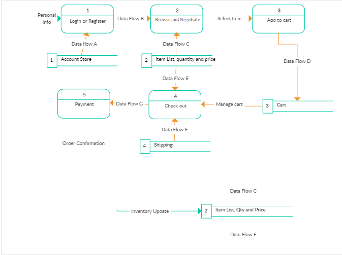
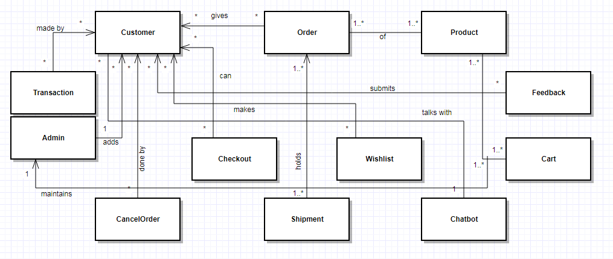
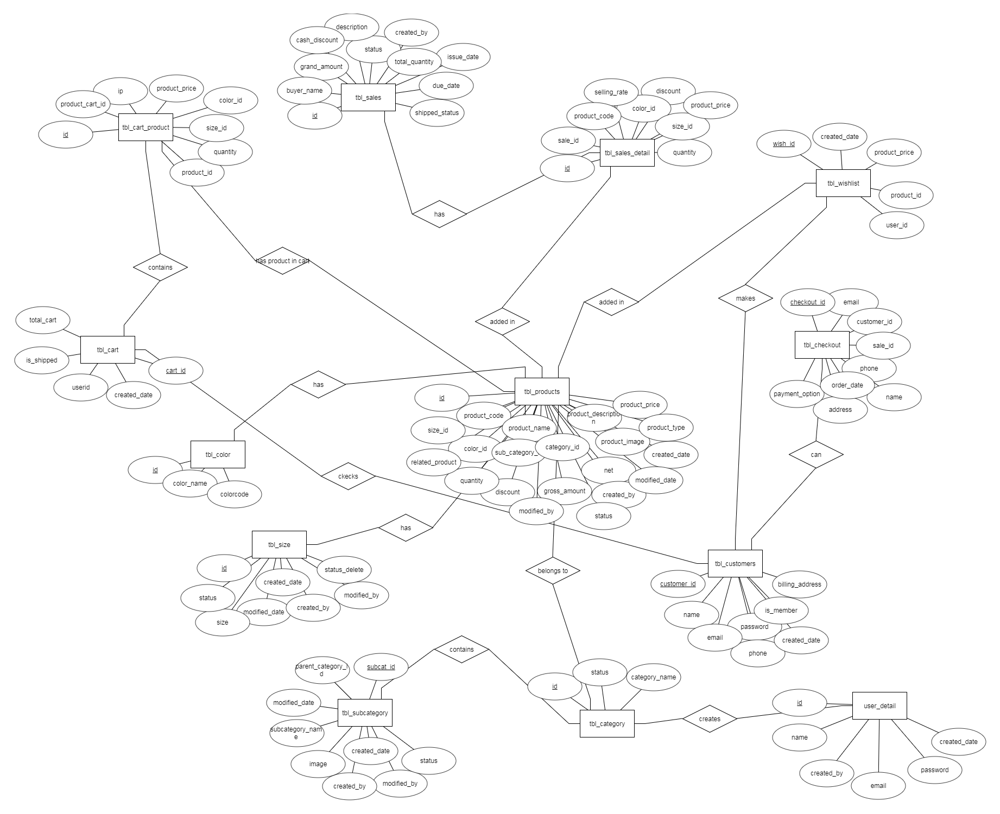

# Software Design Specification
## For  Price Negotiator Ecommerce ChatBot System

### Prepared by: 
 * MD. Sakil Khan Shadhin
 * A. M. Almarufuzzaman
 * Md Abrar Fahim Jaki
 * Hossain Md. Sadman

## 1. Introduction
### 1.1 Purpose of this document
This document will define the design of the newmarket.com and its intelligent negotiator . It contains specific information about the expected input, output, classes, and functions. The interaction between the classes to meet the desired requirements are outlined in detailed figures at the end of the document.

### 1.2 Scope of the development project
  For Most of the e-commerce site, there is no option for negotiation though customers want to negotiate. To solve this problem this software has an intelligent negotiator. It negotiate with customers without any human supervisory. So customer will get 24 hours service. As a e-commerce software it will save customer time cost and labor.

### 1.3 References
Template from:  https://www.facebook.com/groups/2031803807104752/2050910535194079/

### 1.4 Overview of document
- [Section 1.0](#markdown-header-1-introduction):  An introduction to the document by explaining the purpose of the                                                                                      document, providing terms and references, and a brief overview of each section within the document.

- [Section 2.0](#markdown-header-2-architecture): An overview of the system architecture, system components, relationships between the various components, and user interface issues.

- [Section 3.0](#markdown-header-3-component-design-specification(s)): A detailed description of each software component. .

- [Section 4.0](#markdown-header-4-user-interface-issues): An explanation of user interfaces with example 

- [Section 5.0](#markdown-header-5-execution-architecture): A detailed view of execution architecture such as of runtime environment, Processes, deployment view.

- [Section 6.0](#markdown-header-6-design-decisions-and-tradeoffs): Description of Design decisions and tradeoffs.

- [Section 7.0](#markdown-header-7-appendices): An appendix.

## 2. Architecture
Our system is designed with extensibility and scalability in mind.  We are taking great care in designing a framework which can be updated easily.  Many of the anticipated changes to our system in future phases will only require adding new types of data and changing the user presentation code to make use of these new data.

----------
## 3. Component Design Specification(s)
### 3.1 UML diagram:

----------

###3.2 ER Diagram:

----------

## 4. User interface issues
### 4.1 Website:
The purpose of the ecommerce website is to here visitors can see the publicly available features such as browse products, view details of products (Size, Color and Cost) and view other static contents of site. Registered User can view all publicly available features and in addition to this they can purchase the products by adding them into shopping cart. Admin can manage all the contents and orders from the backend. Especially visitor can buy their desire product by negotiate price which we will be done by AI system negotiation chat bot.

After go to our website, the server will provide the HOME page of our website. This website is basically a clothing ecommerce website where customer can buy cloth. So in the HOME page at the top of it there will be our website logo with a name and also a small description. Then there will be a bar with different types of option and the visitor can hover the option and he or she can choose the option which they want. After that there will be a big image bot which is scrolling. There will show the different types of features and products idea about the website. And then there will be a discount bar which offers recent discounts of products to the customers. Then will be some description about our company and other stuffs. At the end of the page there is a footer items bar.

In the option bar there are five options which are HOME, PRODUCTS, BUYNOW, FAVOURITESand LOGIN.

In the PRODUCTS option, there will be the list of our products which is separated with different categories. Visitor can scroll down for more products. In every product, there will be some information and some option to choose. Options are ADD FAVOURITE, BUYNOW, and PRICE NEGOTIATION. And the information’s are PRODUCT NAME, DETAILS, PRICE with the product image.

In BUYNOW option there are two parts which the customer should fill up to ORDER. Which are “YOUR ORDER SUMMARY” and “ADD YOUR INFORMATION TO ORDER”. “YOUR ORDER SUMMARY” option there is a description and the amount is given and the price will be the negotiate price with product name and details. At the end of it there is an item total of the products. This is basically like a cash memo. Another part is the OPDER option. This website is also working as a cash on delivery service. To ORDER, the customer should fill up some credentials and click the ORDER option. The credentials are USER NAME, PHONE NUMBER, STREET ADDRESS, POST-CODE, FLAT, CITY and COUNTRY. Which will be automatically generated if you have already LOGIN in our website or you want to change the credentials.

In the FAVOURITES option there will be the list of all favorite items which is shorted by date and time. And there is an option to remove the item from the list.

Now describe about the LOGIN option of this site. Here are two option to choose. If you already SIGNUP then choose “CUSTOMER LOGIN” option, here you just put your USER NAME or EMAIL, PASSWORD and submit to successfully LOGIN in our website. Another option is “NEED AN ACCOUNT”, here you have to fill up some option like NAME, EMAIL, PHONE NUMBER, GENDER, ADDRESS and HOW DID YOU HEAR ABOUT US option. After that there are SUBMIT and RESET buttons. Customer can do what they want to do. Most importantly there is an option for FEDERSTED IDENTITY PROVIER where you can LOGIN with FACEBOOK and GOOGLE+ account.

Now the last part is NEGOTIATION CHAT BOT, where customer can chat with the negotiator which is fully controlled by ARTIFICIAL INTELLIGENCE. This chat bot is designed by branch of different option with “TYPE A MESSAGE” bar where customer can chat to negotiate the price of the product.

### 4.2 Android:

-	Upon entering our android application, the buyer is required to login using his username/ email id & password. If  he/she doesn’t have any account then we have an option for them to signup. The signup button takes him/her to another page which tells him/her to fill in details like FULL NAME, ADDRESS, CONTACT NO., EMAIL ID. He/she then is allowed to choose their own password. When they’re done with it, then they can select CREATE ACCOUNT to create their account. We also have the option to sign in using Facebook or Google Plus.
-	The main interface of the app will feature the name of the website at the top middle, the main menu at the top left and the shop cart button and the messaging button at the top right. Under that, it will feature the new collection of clothes that have just arrived to our store. Under that, we’ll have a search option and then under that we’ll have our popular products section.
-	When we open the main menu, it will show the features CLOTHING, SHOES, SPORTS, BAGS & ACCESORIES, ACCOUNTS & SETTINGS. Going to one of the first 4 menus will show the available apparel we have of that sort.
-	Opening the shop cart button will open up a cart option where our buyers will be able to start shopping. Here they can select multiple items to purchase and then the PROCEED TO CHECKPOINT button will allow them to make the purchase after they have done with their shopping.
-	In the checkout option, we’ll have a coupon section where the buyers will be able to use their coupons if they have any available. If not, there are SELECT A COUNTRY, FULL NAME, ADDRESS, TOWN/CITY & POSTCODE AND PHONE options for the buyers to fill for them to receive the delivery. When they’re done with all this, we’ll redirect them to the main page and hit them up with a confirmation message saying “CONGRATS, WE’LL SEND YOU AN EMAIL WHEN YOUR ORDER IS SHIPPED.”
-	If a buyer wants to contact us directly, he/she can go to the message option at the top right and then he/she will be taken to another page which will feature a chatbot in which they can write what they want to say to us. When they’re done, they can select the SEND option to send that message.

## 5. Execution Architecture
We will develop frontend of our system with HTML, CSS &Javascript and backend with PHP, MySQL using CodeIgniter framework&Apacheserver as well as we will also develop Android version of our system. For artificial intelligent part we’ll integrate available built-in suitable AI application.  
After completing design and developing frontend then we can design backend of our system, finally developing backend we can try to test our system. For any modification or change if necessary we have to it anytime for our system requirement as well and for Chatbot session, chatting smartness is main challenge of our system, we’ll try to develop a smart Chatbot for price negotiation only at our best level. 

## 6. Design decisions and tradeoffs
First of all, the Homepage of the website and the android app won't show all of the products. The Homepage will show the notice of any offer or news of any upcoming events. The Homepage will also show only a few of the most popular products of the site. At the bottom of each webpage except Products pages and Billing page there will be the category list horizontally those will be - Women, Men, Kids.

The Products-page will show the most popular products as well as the new products of the sites. When a web-browsing user use the website, for the Products Tab whenever they point their mouse cursor on the Products Tab, it will show a drop down menu different categories for the products - Women, Men, Kids. Each of those categories will have sub-categories as drop down menu; Such as, for Men - Shirts, Tees, Panjabi, Pants, Footwear, Accessories etc. But these sub-categories can also have sub-categories as well. These categories and sub-categories are the Tag of the products.

Whenever a person wants to add their products on the site they have to use these Tags. For the Products there will be also some other Tags which won't be shown as categories; for example: for tagging the Colors, seller can simply add the color name - Red, Green, Black, White etc. A product may contain multiple colors in that case seller tag those with multiple color names. Some seller may not want to negotiate their selling price; in that case they must have to use "Fixed Price" as tag. For this tag AI won't going to negotiate the price on its own. For selling used products, seller have to also use "Used" as tag.

A seller must have to upload at least 3 set of good quality photos for their products so that a customer can judge easily about the product. These 3 set of photos can be - font side, back side and Closer to design.

Products pages, Favorites page and the search result page can be divided into multiple pages. How much a page can consist will be not more than 20 items but a user can change that range up to 50 items per page for them.

On the site or the android app there won't be a search bar for searching Products but on the site and the android app there will be a chat bot which will be integrated with AI. This chat bot will able to search products based on tags, keywords, price range etc. And this chat bot will available on every pages.

Customers often feel nervous about sharing their credit or debit card info so for our site we are sticking with 'Cash On Delivery' system. And the billing page will be as detailed as possible. There will be one column in the center of the page for collecting customer's info. And this page won't consists any ads or offers. This page will be as simple as possible. This detail view gives customers to review their buying products. They can also remove any item if they want form the billing items menu. Sometimes a customer can accidently remove an or multiple item in that case they will able to undo their choices.  But if they refresh the page they won’t able to recover removed items.

For Checking Out process a customer can "Log In" into their account so that website or android app can automatically update their checking out info which will be First Name, Last Name, Delivery Address (City, Area, Street Address, House Number) and Phone Number. Or instead of logging in they can fill the checking out form manually. 

This site show pop up only about great offer and Order Conformation.

Favorites-page is quite simple. It will show a bunch of products which was marked by the user as favorite.

For website footer is important because it acts as a security symbol for users. Privacy policy, terms and conditions, company name and contact info should all be part of webpages footer and include hyperlinks to relevant pages such as social media.

## 7 Appendices

None at this time.
