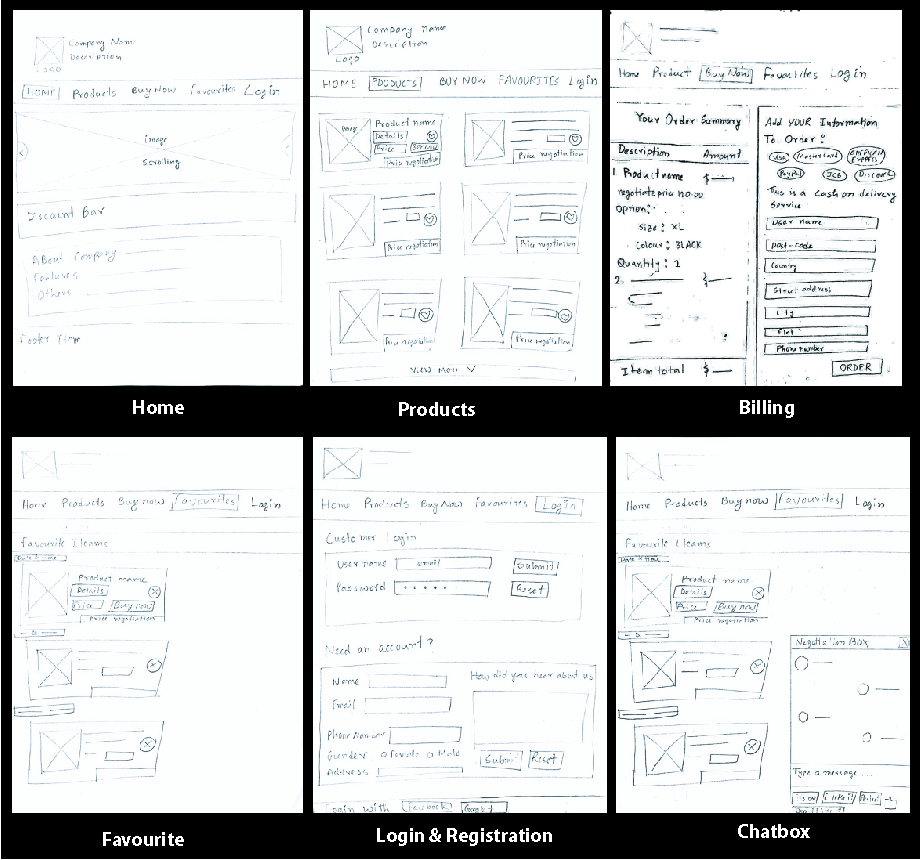
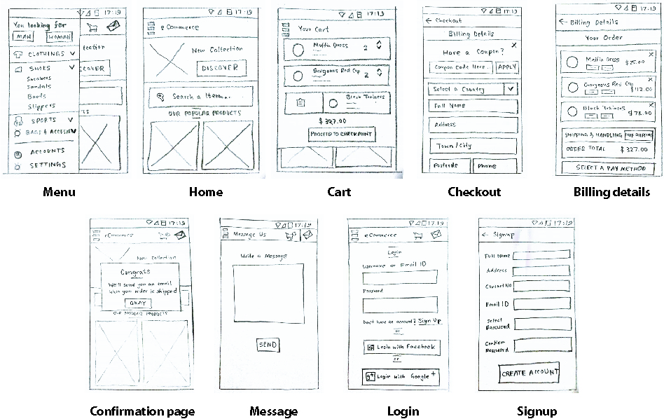
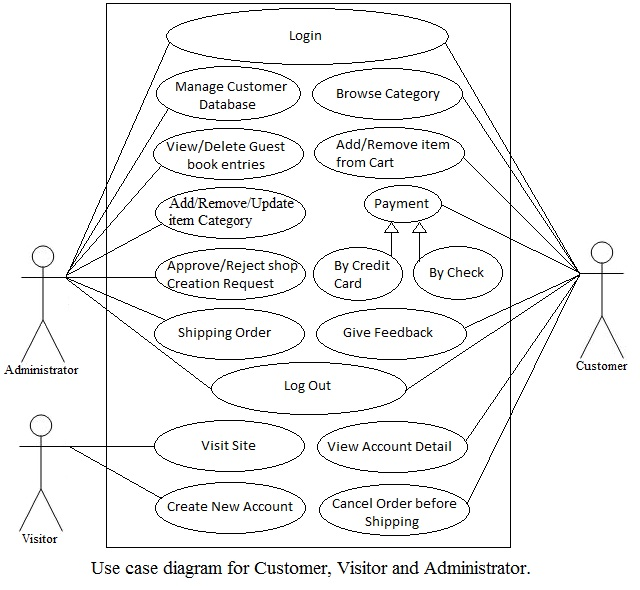
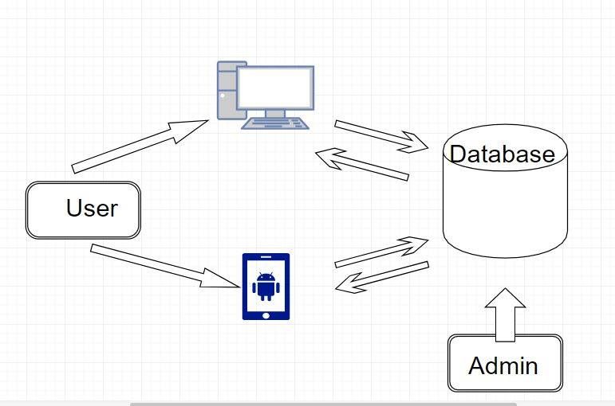

# Software Requirements Specification
## For  Price Negotiator Ecommerce ChatBot System

### Prepared by: 
 * MD. Sakil Khan Shadhin
 * A. M. Almarufuzzaman
 * Md Abrar Fahim Jaki
 * Hossain Md. Sadman

# Table of Contents
  * [Introduction](#markdown-header-1-introduction)
    * 1.1 [Purpose](#markdown-header-11-purpose)
    * 1.2 [Document Conventions](#markdown-header-12-document-conventions)
    * 1.3 [Intended Audience and Reading Suggestions](#markdown-header-13-intended-audience-and-reading-suggestions)
    * 1.4 [Product Scope](#markdown-header-14-product-scope)
    * 1.5 [References](#markdown-header-15-references)
  * [Overall Description](#markdown-header-2-overall-description)
    * 2.1 [Product Perspective](#markdown-header-21-product-perspective)
    * 2.2 [Product Functions](#markdown-header-22-product-functions)
    * 2.3 [User Classes and Characteristics](#markdown-header-23-user-classes-and-characteristics)
    * 2.4 [Operating Environment](#markdown-header-24-operating-environment)
    * 2.5 [Design and Implementation Constraints](#markdown-header-25-design-and-implementation-constraints)
    * 2.6 [User Documentation](#markdown-header-26-user-documentation)
    * 2.7 [Assumptions and Dependencies](#markdown-header-27-assumptions-and-dependencies)
  * [External Interface Requirements](#markdown-header-3-external-interface-requirements)
    * 3.1 [User Interfaces](#markdown-header-31-user-interfaces)
    * 3.2 [Hardware Interfaces](#markdown-header-32-hardware-interfaces)
    * 3.3 [Software Interfaces](#markdown-header-33-software-interfaces)
    * 3.4 [Communications Interfaces](#markdown-header-34-communications-interfaces)
  * [System Features](#markdown-header-4-system-features)
    * 4.1 [The User](#markdown-header-41-the-user)
    * 4.2 [Admin](#markdown-header-42-admin)
    * 4.3 [Chatbot](#markdown-header-43-chatbot)
  * [Other Nonfunctional Requirements](#markdown-header-5-other-nonfunctional-requirements)
    * 5.1 [Performance Requirements](#markdown-header-51-performance-requirements)
    * 5.2 [Safety Requirements](#markdown-header-52-safety-requirements)
    * 5.3 [Security Requirements](#markdown-header-53-security-requirements)
    * 5.4 [Software Quality Attributes](#markdown-header-54-software-quality-attributes)
    * 5.5 [Business Rules](#markdown-header-55-business-rules)
  * [Appendix A: Analysis Models](#markdown-header-appendix-a-analysis-models)
  * [Appendix B: To Be Determined List](#markdown-header-appendix-b-to-be-determined-list)

## 1. Introduction
### 1.1 Purpose 
This SRS describes the requirements and specifications of e-commerce site. It explains the functional features, along with interface details, design constraints and other issues.

### 1.2 Document Conventions

- Highlighted line for functional requirements. 
- Blue colored text for essential links. 
- Underlined text will be considered as most important and must to read. 

### 1.3 Intended Audience and Reading Suggestions
This document is for users, designers, developers, testers and owner of this software. It will give themselves a clear concept about what to made, how to made and purpose of this software. It will also highlights time, budget and tools constrains. Rest of the SRS contains overall description of this software, user interface design, functional requirements, non functional requirements, Hardware and software interfaces and constrains. 

### 1.4 Product Scope
For Most of the e-commerce site, there is no option for negotiation though customers want to negotiate. To solve this problem this software has an intelligent negotiator. It negotiate with customers without any human supervisory. So customer will get 24 hours service. As a e-commerce software it will save customer time cost and labor.

### 1.5 References
> 830-1984 - IEEE Guide for Software Requirements Specifications

> http://nevonprojects.com/price-negotiator-ecommerce-chatbot-system/

## 2. Overall Description
### 2.1	Product Perspective
As mentioned earlier this software has an intelligent negotiator which will be active 24 hour for the service of customers. For selling a product we have to know customers willingness to pay (WTP). Its AI trained negotiator will determine customer WTP and negotiate intelligently. It can be an open platform for buyers and sellers where they can buy and sell their good by opening an account.

### 2.2	Product Functions
- Getting user information
- user cart
- user wish-list
- appear desired goods
- active online negotiator
- Orders
- sale's list

### 2.3	User Classes and Characteristics
Users are people who know basic levels of English and know simple browsing. 

### 2.4	Operating Environment
This software operates well form any personal computer and mobile devices. Any browser will supports its all features. Online negotiator will be published as an application for android devices too. 

### 2.5	Design and Implementation Constraints
Android app for online negotiator developers may face some difficulties while working on android studio. Because it needs large amount of ram to operate. 

### 2.6	User Documentation
User will get some demo for operating this software. There will be a help button for any kind of help and they can rate any product, its sellers and can give reviews.

### 2.7	Assumptions and Dependencies
This software may be depended on some codes for Artificial Intelligent. Because of time constrains we may not be able to create a new AI and train it. This software will use php framework codeingiter to develop it in MVC structure. It also may be depended on some existing data of product list and price.   

## 3. External Interface Requirements
### 3.1 User Interfaces
There will be two types of user interface. One is for website and another is for android app. Wireframes are given below:

#### **For web portal:**

#### **For android:**

### 3.2 Hardware Interfaces
Since neither the mobile application nor the web portal have any designated hardware, it does not have any direct hardware interfaces. The hardware connection to the database server is managed by the underlying operating system on the mobile phone and the web server.

### 3.3 Software Interfaces
The mobile application and the website, both will help user to find their desired product. The communication between the database and the web portal consists of operation concerning both reading and modifying the data, while the communication between the database and the mobile application consists of only reading operations.

### 3.4 Communications Interfaces
The communication between the different parts of the system is important since they depend on each other. However, in what way the communication is achieved is not important for the system and is therefore handled by the underlying operating systems for both the mobile application and the web portal.

## 4. System Features
This section includes the requirements that specify all the fundamental actions of the software system. 
### 4.1 The User

#### 4.1.1   User registration
Given that a user has downloaded the mobile application, then the user should be able to register through the mobile application. The user must provide full-name, address, contact no, e-mail address and password.

#### 4.1.2   User log-in
Given that a user has registered, then the user should be able to log in to the mobile application. The log-in information will be stored on the phone. 

#### 4.1.3   Search
The user should be able to search for a cloth, according to several search options. 
The search options are Price, cloth type. There should also be a free-text search option.

#### 4.1.3   Search
The user should be able to search for a cloth, according to several search options. 
The search options are Price, cloth type. There should also be a free-text search option. 

#### 4.1.4   Order
The user should be able to order a product after searching and knowing the details.

#### 4.1.5   Message box
There will be a message box, from where user can contact with support team, more specifically, with a automated intelligent price negotiator. 

#### 4.1.6   Profile
The user should be able view, edit their profile.

### 4.2 Admin

#### 4.2.1   Add product
Admin can add a new product. And able to set price, stocks, descriptions, type etc.

#### 4.2.1   Modify product
Admin can modify an existing product.

#### 4.2.3   Delete product
Admin can also delete a product. 

#### 4.2.4   View orders
Admin should able to view new orders, delivered orders and pending orders.

### 4.3 Chatbot

#### 4.3.1 Recommend
Chatbot should be able to recommend appropriate products to users.

#### 4.3.2 Negotiation
After providing product's details to user, it should be able to negotiate with customers.

#### 4.3.3 Taking orders
Under a valid price and items, it will take orders from customers and update database.

## 5. Other Nonfunctional Requirements
### 5.1 Performance Requirements
 
** A) E-R DIAGRAM: ** 

The E-R Diagram constitutes a technique for representing the logical structure of a database in a pictorial manner. This analysis is then used to organize data as a relation, normalizing relation and finally obtaining a relation database.

 * ENTITIES: Which specify distinct real-world items in an application.
 * PROPERTIES/ATTRIBUTES: Which specify properties of an entity and relationships.
 * RELATIONSHIPS: Which connect entities and represent meaningful dependencies between them.

** B) NORMALIZATION: **

The basic objective of normalization is to reduce redundancy which means that information is to be stored only once. Storing information several times leads to wastage of storage space and increase in the total size of the data stored.

If a database is not properly designed it can give rise to modification anomalies. Modification anomalies arise when data is added to, changed or deleted from a database table. Similarly, in traditional databases as well as improperly designed relational databases, data redundancy can be a problem. These can be eliminated by normalizing a database.

Normalization is the process of breaking down a table into smaller tables. So that each table deals with a single theme. There are three different kinds of modifications of anomalies and formulated the first, second and third normal forms (3NF) is considered sufficient for most practical purposes. It should be considered only after a thorough analysis and complete understanding of its implications.

### 5.2 Safety Requirements
If there is extensive damage to a wide portion of the database due to catastrophic failure, such as a disk crash, the recovery method restores a past copy of the database that was backed up to archival storage (typically tape) and reconstructs a more current state by reapplying or redoing the operations of committed transactions from the backed up log, up to the time of failure.

### 5.3 Security Requirements
Security systems need database storage just like many other applications. However, the special requirements of the security market mean that vendors must choose their database partner carefully.

### 5.4 Software Quality Attributes
* ** AVAILABILITY: ** The product should be available.
* ** CORRECTNESS: ** The product should reach the correct customer.
* ** USABILITY: ** The service should satisfy a maximum number of customers needs.

### 5.5 Business Rules
Admin should add, modify and delete product without taking help of the chatbot. Chatbot should be used only for supplying details and negotiating. Any offers and notices should be created by admins.

## Appendix A: Analysis Models

### Use case diagram:

### System connection:

## Appendix B: To Be Determined List

### Chatbot
A chatbot will help help users to find desired products and should be able to deal with them
### Recommender system for android
It will recommend users to buy best products according to efficient prices or demands.
